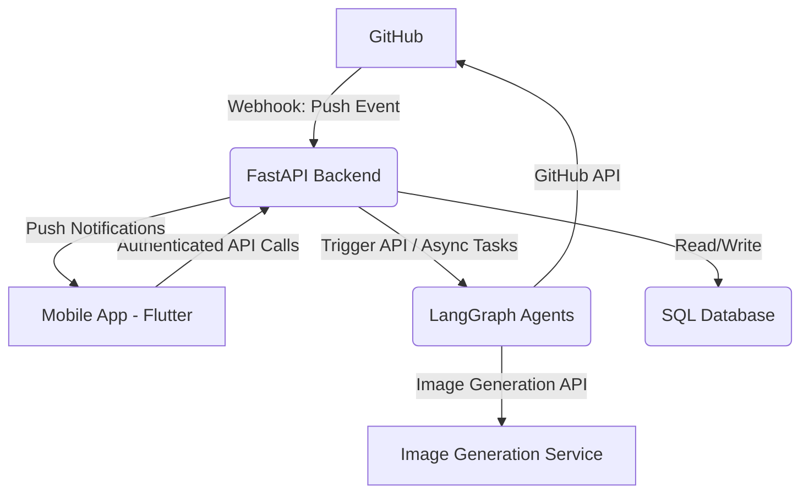
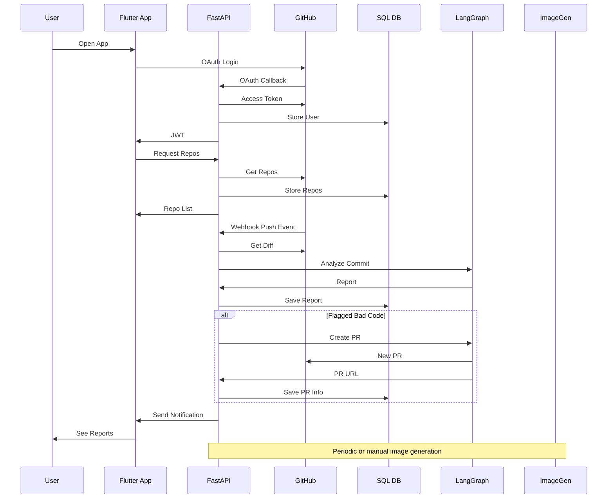

# 🤖 AI-Powered Code Analysis & Developer Efficiency App

This repository contains the **system design documentation** for a mobile application that provides **GitHub repository owners** with **AI-powered insights** into commit history, code quality, and developer efficiency.

---

## 📑 Table of Contents

- [Overview](#overview)
- [High-Level Architecture](#high-level-architecture)
- [Detailed Component Breakdown](#detailed-component-breakdown)
  - [📱 Mobile App (Flutter)](#📱-mobile-app-flutter)
  - [🚀 Backend API (FastAPI)](#🚀-backend-api-fastapi)
  - [🗄️ SQL Database Schema](#🗄️-sql-database-schema)
  - [🧠 AI/Automation Layer (LangGraph Agents)](#🧠-aiautomation-layer-langgraph-agents)
- [🔄 Data Flow and Interactions](#🔄-data-flow-and-interactions)
- [⚙️ Key Technologies](#️-key-technologies)
- [🔐 Security Considerations](#-security-considerations)
- [📈 Scalability and Performance](#-scalability-and-performance)

---

## ✅ Overview

This application provides GitHub repository owners with a powerful tool to:

- 🧠 **Automatically analyze commit intent** and summarize changes.
- 📊 **Assess efficiency and quality** of code pushes.
- 👤 **Track developer performance** based on code quality.
- 🚨 **Automatically request Pull Requests** for problematic code.
- 🖼️ **Visualize project progress** through AI-generated images.

---

## 🏗️ High-Level Architecture

The system has four primary layers:

- **📱 Mobile App (Flutter)** – User-facing application.
- **🚀 Backend API (FastAPI)** – Core business logic.
- **🧠 LangGraph Agents** – AI/automation logic.
- **🗄️ SQL Database** – Persistent storage.

---

## 🔍 Detailed Component Breakdown

### 📱 Mobile App (Flutter)

- **GitHub OAuth Login**
- **Repository List**
- **Commit History View** w/ summaries
- **Commit Detail View** w/ reports and PR status
- **Push Notifications** via Firebase
- **Efficiency Dashboard**
- **Project Progress Images**

### 🚀 Backend API (FastAPI)

- GitHub OAuth & JWT Auth
- GitHub Webhook Handler
- LLM Agent Orchestration
- SQL CRUD (via SQLAlchemy)
- Push Notifications (Firebase)
- Image Generation Integration

### 🗄️ SQL Database Schema

#### `Users`

| Field               | Type     |
|--------------------|----------|
| id (UUID, PK)       | UUID     |
| github_id          | String   |
| access_token (Encrypted) | String |
| fcm_token          | String   |

#### `Repositories`

| Field       | Type |
|------------|------|
| id (UUID)   | UUID |
| github_repo_id | String |
| owner_id   | FK (Users) |

#### `Commits`

| Field                | Type     |
|---------------------|----------|
| id, repo_id         | UUID, FK |
| commit_hash         | String   |
| summary, efficiency | JSON/Text|

#### `Developers`

| Field               | Type     |
|--------------------|----------|
| github_id          | String   |
| average_efficiency | Float    |

#### `ProjectProgressImages`

| Field         | Type     |
|--------------|----------|
| repository_id| UUID     |
| image_url    | String   |

### 🧠 AI/Automation Layer (LangGraph Agents)

#### Commit Intent Analyzer

- 📥 Inputs: commit hashes, repo name
- 📊 Outputs: summary, observations, efficiency score
- 🚨 Flags bad code

#### PR Request Agent

- 🔄 Creates PR on GitHub if flagged

#### Project Progress Visualizer

- 🖼️ Aggregates data → Generates image

---

## 🔄 Data Flow and Interactions

---

## ⚙️ Key Technologies

| Layer          | Tools/Technologies                          |
|----------------|---------------------------------------------|
| Frontend       | Flutter                                     |
| Backend        | FastAPI, SQLAlchemy, httpx, python-jose     |
| DB             | PostgreSQL / MySQL / SQLite                 |
| Auth           | GitHub OAuth + JWT                          |
| AI Layer       | LangGraph, Gemini API, PyGithub             |
| Notifications  | Firebase Cloud Messaging (FCM)              |
| Image Gen      | Stability AI / DALL-E / Imagen              |

---

## 🔐 Security Considerations

- 🔒 Encrypted GitHub Access Tokens
- 🔑 JWT-based API Security
- ✅ Webhook Signature Verification
- 🛡️ LLM Prompt Injection Prevention
- 🔍 Sensitive Log Filtering

---

## 📈 Scalability and Performance

- ⚙️ Async FastAPI handlers
- 🧠 Background tasks or Celery (for heavy LLM tasks)
- 🔄 Caching + Indexed DB Queries
- 🧪 Load tested LangGraph calls
- 🧩 Modular microservice-friendly design

---

> ✨ Designed to bring intelligent oversight to code repositories — empowering owners with clarity, control, and confidence over their team’s code quality and efficiency.
